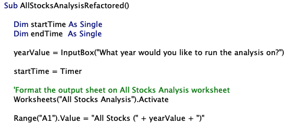
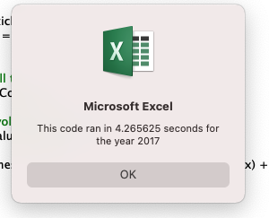
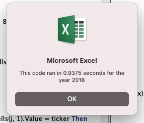

# Stock-Analysis
Performing analysis on stocks to calcualte the daily total volumen and return

## Table of Contents
- [1.0 Introduction](#Introduction)
  * 1.1 Purpose
  * 1.2 Tools
- [2.0 Results](#Results)
  * 2.1 Stock Performance 2017 and 2018
    * 2.1.1 Original Script
    * 2.1.2 Refactored Script
- [3.0 Summary](#Summary)
- [4.0 Challenges](#Challenges)

## 1.0 Introduction

### 1.1 Purpose
Steve wants to know how 12 stocks performed in 2017 and 2018 with a click of a button. This code should run efficiently and also provide the yearly wolumes needed for the year requested, and the yearly return as well as volume. 

### 1.2 Tools
- Excel
  - VBA
 

## 2.0 Results
### 2.1 Stock Performance 2017 and 2018
The 2017 and 2018 stock performance consists of analyzing 12 stocks. The datasets contain 3013 rows. When comparing the results between 2017 and 2018 for the 11 stocks, it can be seen that the rate of return was significantly higher for a majority of the stocks. The only stock that increased in 2018 was 'RUN'. The rate of return of this stock went from 5.5% to 84.0%. Although the rate of return decreased for a majority of the stocks, there was an overall increase the total daily volumes for the wells. 

#### 2.1.1 Original Script
The original script was hardcoded to read one sheet, therefore a manual change was required in order to read another sheet.  
`Worksheets("2018").Activate`
The script took 5.05 seconds to run through 2017 and 5.70 seconds to run through 2018.

#### 2.1.2 Refactored Script
The refactored script allows for efficient run time for thousands of entries where the original script could only be efficiently run for a few hundred. The difference in run time demonstrates how the refactored code is more efficient.
This script allowed for the user to choose which year the script should analyze, by setting a variable "yearValue". 

The refactored script took 0.89 seconds to run through 2017 and 0.94 seconds to run through 2018. The script ran this quickly once a button was added to the xlsm file. Previously when running the script out of the developer macro screen it was taking roughly 4.5 seconds to run for each year. 

## 3.0 Summary
The advantages of refactoring a code, is that it typically runs faster, by being more efficient and using less memory. It also should improve the readability of the code. The disadvantages are that it requires additional time to refactor code. The refactored code could introduce more errors into the code or alter what the code should be doing.  

The stocks code did run faster when refactoring the code and now the code can be run on any year of choice with the message box prompt at the beginning. This allows for flexibility and no need to enter the macro itself and rewrite the code itself. 

## 4.0 Challenges

The main challenges faced in this module was learning a new language and understanding how an index should be written in VBA.  The module did not clearly explain how to create an index, so therefore days were spent trying to understand how an index should be written in VBA. Another challenge faced was understanding what the code was exactly doing and learning how to read VBA. After attending many office hours it was clear how to interpret the code, which enabled me to understnad how to identify errors and gaps in my code.  I was able to identify where there was an error in my code when outputting the yearly percentage return for every stock, but did not have an issue outputting the yearly volume.  

  

This issue was very unclear to me as the volumes were outputting correctly, but the start and end ticker prices were not. When entertering a message box to print the starting and ending price for each stock, I could identify that the script was not working properly as each stock had the same starting and ending price which was the ending price for VSLR by typing in the following into the code:

`MsgBox (ticker & " starting " & tickerStartingPrices(tickerIndex))`

`MsgBox (ticker & " ending " & tickerEndingPrices(tickerIndex))`

The piece I was missing was in 3b and 3c I needed to have an 'And' statment to check that the current ticker we are on is the tickerIndex that we are looking at, as well that the row before or row after do not equal the tickerIndex.

