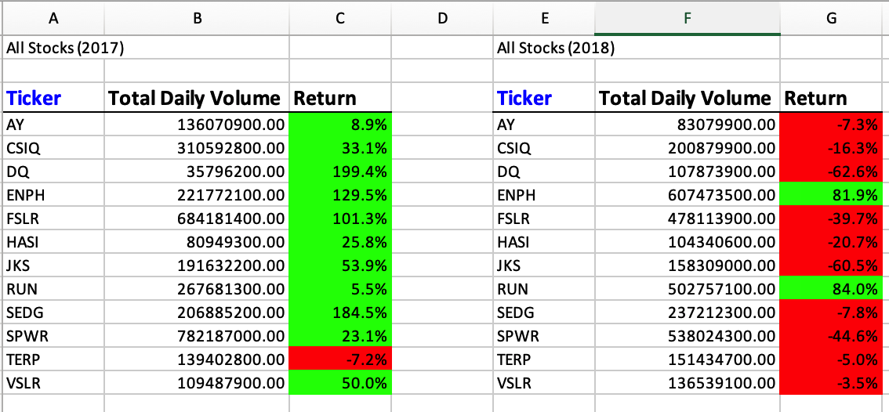
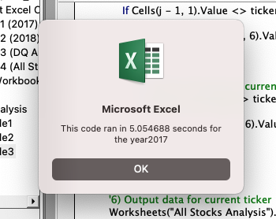
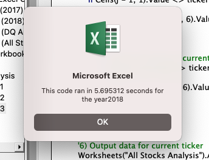

# Stock-Analysis
Performing analysis on stocks to calcualte the daily total volumen and return

## Table of Contents
- [1.0 Introduction](#Introduction)
  * 1.1 Purpose
  * 1.2 Tools
- [2.0 Results](#Results)
  * 2.1 Stock Performance 2017 and 2018
    * 2.1.1 Original Script
    * 2.1.2 Refactored Script
- [3.0 Summary](#Summary)
- [4.0 Challenges](#Challenges)

## 1.0 Introduction

### 1.1 Purpose
Steve wants to know how 12 stocks performed in 2017 and 2018 with a click of a button. This code should run efficiently and also provide the yearly information needed for the year requested.  He wants to know the yearly return as well as volume. 

### 1.2 Tools
- Excel
  - VBA
 

## 2.0 Results
### 2.1 Stock Performance 2017 and 2018
The 2017 and 2018 stock performance consists of analyzing 12 stocks. The datasets contain 3013 rows. When comparing the results between 2017 and 2018 for the 11 stocks, it can be seen that the rate of return was significantly higher for a majority of the stocks. The only stock that increased in 2018 was 'RUN'. The rate of return of this stock went from 5.5% to 84.0%. Although the rate of return decreased for a majority of the stocks, there was an overall increase the total daily volumes for the wells. 

#### 2.1.1 Original Script
The original script was hardcoded to read one sheet, therefore a manual change was required in order to read another sheet.  
`Worksheets("2018").Activate`
The script took 5.05 seconds to run through 2017 and 5.70 seconds to run through 2018.

   

#### 2.1.2 Refactored Script

## 3.0 Summary
The advantages of refactoring a code, is that it typically runs faster, by being more efficient. It also should improve the readability of the code. The disadvantages are that it requires additional time to refactor code. The refactored code could introduce more errors into the code or alter what the code should be doing.  

The stocks code did run faster when refactoring the code, but unfortunately it introduced more errors, such as being unable to pull the starting and ending prices for each code properly.  

## 4.0 Challenges

The main challenges faced in this module was understanding how an index should be written in VBA.  The module did not clearly explain this, so therefore days were spent trying to understand how an index should be written in VBA. Another challenge faced was understanding what the code was exactly doing.  After attending many office hours it was clear how to interpret the code.  I also had a challenge outputting the yearly percentage return for every stock, but did not have an issue outputting the yearly volume.  This was unclear as to why the volumes were outputting correctly, but the start and end ticker prices were not. When entertering a message box to print the starting and ending price for each stock, I could identify that the script was not working properly as each stock had the same starting and ending price which was the ending price for VSLR. 

  

