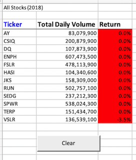
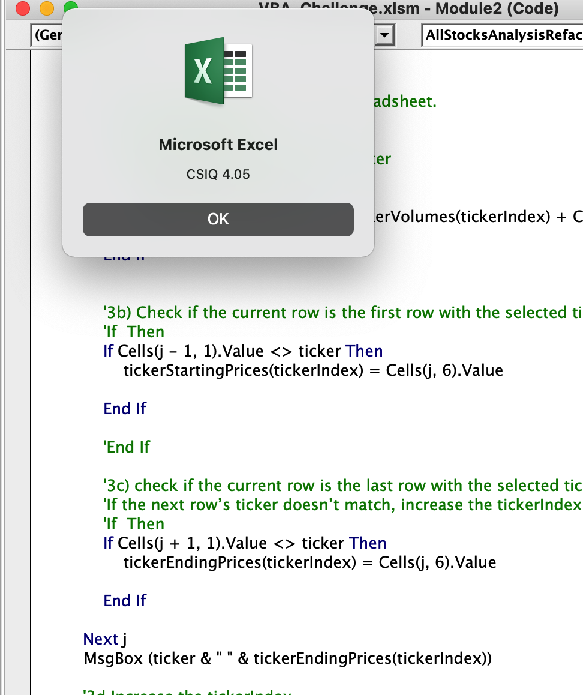

# Stock-Analysis
Performing analysis on stocks to calcualte the daily total volumen and return

## Table of Contents
- [1.0 Introduction](#Introduction)
  * 1.1 Purpose
  * 1.2 Tools
- [2.0 Results](#Results)
  * 2.1 Stock Performance 2017 and 2018
- [3.0 Summary](#Summary)
- [4.0 Challenges](#Challenges)

## 1.0 Introduction

### 1.1 Purpose
Steve wants to know how the stocks performed in 2017 and 2018 with a click of a button. This code should run efficiently and also provide the yearly information needed for the year requested.  He wants to know the yearly return as well as volume. 

### 1.2 Tools
- Excel
  - VBA
 

## 2.0 Results
### 2.1 Stock Performance 2017 and 2018
The peak months, April to August, are when the most theaters met or exceeded their goal. The maximum number of plays is in the month of May, and the ratio of successful vs failed is also the greatest in May and June.  From 2009 - 2013 all the plays were successful and then there is a sharp increase in the total number of plays after that.

The availability of data limited the analysis, as data from 2009 to 2013 only contianed successful plays.  The data could also be displayed in a bar chart.

## 3.0 Summary

## 4.0 Challenges

The main challenges faced in this module was understanding how an index should be written in VBA.  The module did not clearly explain this, so therefore days were spent trying to understand how an index should be written in VBA. Another challenge faced was understanding what the code was exactly doing.  After attending many office hours it was clear how to interpret the code.  I also had a challenge outputting the yearly percentage return for every stock, but did not have an issue outputting the yearly volume.  This was unclear as to why the volumes were outputting correctly, but the start and end ticker prices were not. When entertering a message box to print the ending price for each stock, I could identify that the script was not working properly as each stock had the same ending price which was the ending price for VSLR. 

  {width=500px}

